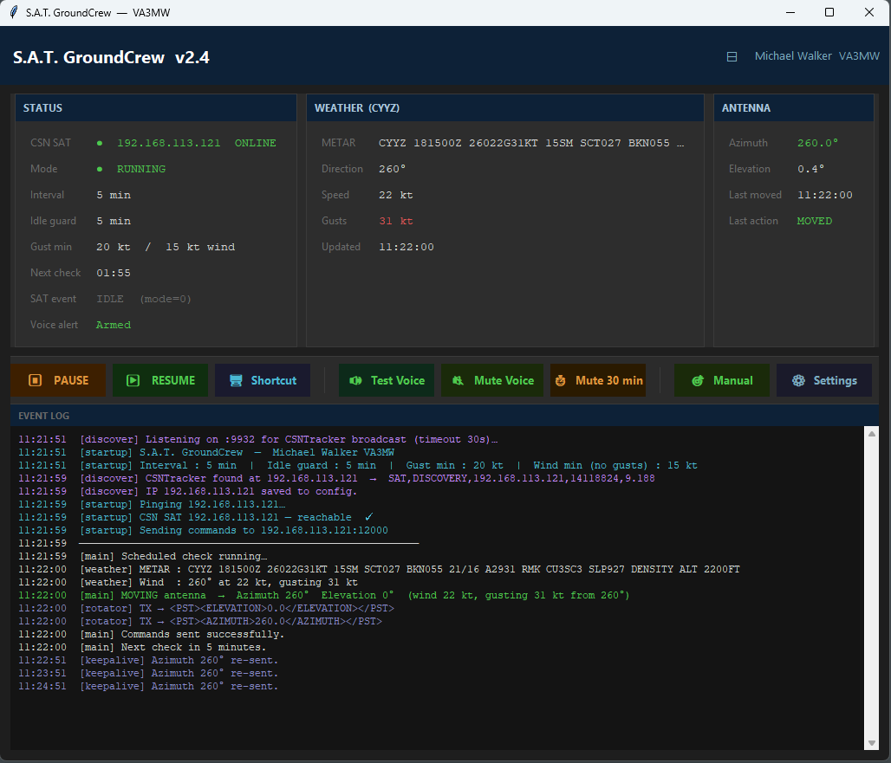
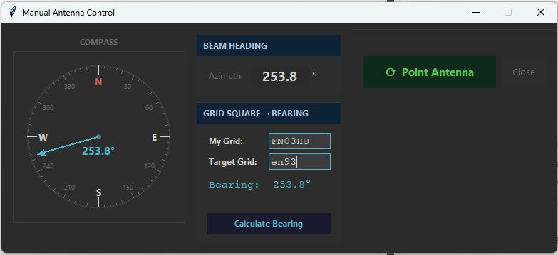

# S.A.T. GroundCrew

**S**atellite **A**ntenna **T**racker — Ground operations assistant for amateur satellite station operators.

**Author:** Michael Walker &nbsp;·&nbsp; VA3MW &nbsp;·&nbsp; Toronto, Ontario, Canada
**Built with:** [Claude](https://claude.ai) (Anthropic) — AI pair programmer
**Version:** 3.0 &nbsp;·&nbsp; 2026-06-18
**File:** `csnSatGC.py`
**License** Personal / amateur radio use. © 2026 Michael Walker VA3MW

---



---

## Overview

S.A.T. GroundCrew is a single-window Python application that keeps your **CSN SAT** antenna controller running unattended between passes and announces upcoming satellite passes by voice so you never miss a window.

| Function | Description |
|---|---|
| **Wind Tracking** | Automatically points the antenna into the prevailing wind when idle, protecting it from unexpected gusts |
| **Park Position** | Returns the antenna to the CSN SAT park position when wind is below threshold |
| **Voice Alerts** | Announces each approaching satellite pass by name and time-to-AOS via Windows Text-to-Speech |
| **SAT Integration** | Listens on UDP port 9932 for CSNTracker broadcasts and backs off the moment a pass begins |
| **Manual Control** | Point the antenna to any bearing via compass, typed heading, or grid square calculation |

---

## Features

- **Auto-discovery** — finds the CSN SAT on your LAN automatically via UDP broadcast; falls back to a manual IP entry dialog if nothing is heard within 30 seconds; discovered IP is saved to `csnSatGC.json` automatically
- **Wind-aware positioning** — fetches live METAR data from NOAA (falling back to VATSIM) and rotates the antenna to face into the wind only when gusts or sustained winds exceed configurable thresholds
- **Park on calm** — when wind is below threshold, queries the CSN SAT for its configured park position (`/status`) and returns the antenna there; keepalive is suppressed while parked so the CSN SAT retains full control
- **Satellite-aware backoff** — honours `SAT,START TRACK`, `SAT,AOS`, and `SAT,LOS` events so the antenna is never repositioned during a live pass
- **Pre-move mode check** — performs a single HTTP `/track` query immediately before each antenna move to confirm the SAT is not tracking; no background polling
- **Manual antenna control** — one-click panel to point the antenna manually at any time using a compass rose, a typed bearing, or a Maidenhead grid square; auto wind-tracking backs off automatically for the idle timeout after a manual command
- **Voice pass alerts** — spoken announcement (`"<name> will be rising in <time>"`) on any `SAT,FAOS` broadcast within the configurable window (default 5 minutes to AOS); one alert per satellite per pass; announcements are serialised so two simultaneous passes never overlap; stale queued messages are discarded automatically
- **Mute controls** — instant mute / unmute toggle, timed 30-minute mute with automatic re-arm, and a **Test Voice** button to verify your speaker before a pass
- **GUI Settings dialog** — all configuration values editable at runtime via the **⚙ Settings** button; changes are saved to `csnSatGC.json` and take effect immediately
- **Dark theme GUI** — live STATUS, WEATHER, and ANTENNA cards with colour-coded event log
- **Keepalive** — resends the last commanded azimuth every 60 seconds to hold wind position against mechanical drift; automatically suppressed when the antenna is at the park position
- **Compact mode** — collapses to a button-only strip (⊟ / ⊞) to minimise screen real estate during a pass
- **Single-instance guard** — prevents a second copy from starting accidentally
- **Desktop shortcut creator** — one-click shortcut that handles OneDrive path redirection correctly

---

## Requirements

| Component | Detail |
|---|---|
| Python | 3.8 or later |
| tkinter | Included with standard Python on Windows |
| requests | `pip install requests` |
| Windows TTS | `System.Speech` via PowerShell — built into Windows 7+, no pip package needed |

---

## Installation

```bash
pip install requests
python csnSatGC.py
```

No other steps are required. On first run you will be prompted for:

1. Your **ICAO weather station code** (e.g. `CYYZ` for Toronto Pearson International)
2. The **CSN SAT IP address** — auto-discovered in most cases; only prompted if the LAN scan times out

Both values are saved to `csnSatGC.json` and pre-filled on every subsequent launch.

---

## Configuration

Settings are stored in `csnSatGC.json` in the same folder as the script and can be changed at any time using the **⚙ Settings** button in the GUI. Changes take effect immediately — no restart required.

| Setting | Default | Description |
|---|---|---|
| `sat_host` | *(auto-discovered)* | CSN SAT IP address — set automatically on first discovery |
| `sat_port` | `12000` | UDP port the SAT accepts PSTRotator commands on |
| `discovery_port` | `9932` | UDP port CSNTracker broadcasts on |
| `discovery_secs` | `30` | Seconds to wait for auto-discovery before prompting |
| `interval_sec` | `300` | Seconds between automatic wind checks (5 min) |
| `idle_timeout` | `300` | Seconds with no SAT event before antenna is considered free |
| `min_gust_kt` | `15` | Gust threshold in knots — antenna moves only above this |
| `min_wind_kt` | `13` | Sustained wind threshold used when no gusts are reported |
| `icao` | `CYYZ` | ICAO airport code for METAR weather fetch |
| `announce_window_secs` | `300` | Only announce a pass if `timetogo` ≤ this value (5 min) |
| `cooldown_secs` | `300` | Minimum seconds between repeat announcements for the same satellite |
| `operator_grid` | *(blank)* | Your home Maidenhead grid square — used by the manual control bearing calculator |

---

## How It Works

### Wind Tracking Loop

Every `interval_sec` seconds the worker thread:

1. Checks whether the operator has manually **paused** updates (⏸ button or `P` key)
2. Checks whether the **antenna is in use** — a recent `SAT,START TRACK` / `SAT,AOS` UDP event, a manual command, or an `IDLE_TIMEOUT` that has not yet elapsed
3. Fetches a fresh **METAR** from NOAA (`tgftp.nws.noaa.gov`), falling back to VATSIM
4. Parses wind direction, speed, and gusts from the `dddssGggKT` group
5. If wind **exceeds** threshold — performs a final mode check via HTTP `/track`, then **moves the antenna** to the wind bearing
6. If wind is **below** threshold — queries `/status` for the CSN SAT park position and **returns the antenna to park**

A keepalive thread re-sends the last wind-direction azimuth every 60 seconds to resist drift. Keepalive is suppressed while the antenna is at the park position.

---

### Voice Alert Pipeline

```
CSNTracker broadcast:  SAT,FAOS,<name>,<az>,<timetogo>
        │
        ├─ timetogo > 300 s? ──────────────────▶  silent skip
        │
        ├─ Voice muted? ───────────────────────▶  silent skip
        │   (cooldown NOT stamped while muted)
        │
        ├─ Announced within cooldown window? ──▶  silent skip
        │
        └─ Stamp cooldown
           Queue  (timestamp, "<name> will be rising in <time>")
                │
                ▼
           TTS worker thread
                │
                ├─ Message > 5 min old? ───────▶  discard silently
                │
                └─ _speak()  (serialised, blocking)
                        │
                        ▼
                Windows System.Speech  ──▶  🔊
```

---

### Satellite Backoff Events

| UDP Broadcast | Action |
|---|---|
| `SAT,START TRACK,name,catno` | Marks antenna **IN USE** — wind checks skipped |
| `SAT,AOS,az` | Refreshes **IN USE** timestamp |
| `SAT,LOS,az` | Clears **IN USE** — wind tracking resumes immediately |
| `SAT,FAOS,name,az,timetogo` | Queues a voice announcement (see pipeline above) |

After `idle_timeout` (default 5 min) with no new SAT events, the antenna is automatically considered free even if a `SAT,LOS` packet was missed.

---

## Manual Antenna Control

Click **🎯 Manual** in the button bar to open the manual control panel. This lets you point the antenna to any bearing at any time without waiting for the next wind-tracking cycle.



### Three ways to set a bearing

**1. Compass rose**
Click or drag anywhere on the compass to set a bearing. The cyan arrow updates live and the selected heading is displayed in the centre of the dial.

**2. Direct heading entry**
Type any value from 0 to 360° in the Azimuth field. The compass syncs immediately.

**3. Grid square → bearing calculator**

| Field | Description |
|---|---|
| My Grid | Your home Maidenhead locator (4 or 6 characters, e.g. `EN82` or `EN82lp`) — saved to config automatically |
| Target Grid | The grid square you want to beam toward |

Press **Calculate Bearing** (or Enter) and the great-circle bearing is computed and fed to both the compass and the heading field. Works with 4-character (1° square) and 6-character (2.5′ subsquare) locators.

### Sending the command

Click **⟳ Point Antenna** to send the PSTRotator azimuth command immediately. The keepalive thread holds the new position, and the auto wind-tracking loop backs off for `idle_timeout` seconds (default 5 min) before resuming normal operation.

---

## Protocols

### PSTRotator — commands sent TO the CSN SAT on UDP port 12000

```
<PST><AZIMUTH>270.0</AZIMUTH></PST>
<PST><ELEVATION>0.0</ELEVATION></PST>
```

### CSNTracker — broadcasts received FROM the CSN SAT on UDP port 9932

```
SAT,DISCOVERY,<ip>,<build>,<fw>
SAT,START TRACK,<name>,<catno>
SAT,AOS,<az>
SAT,LOS,<az>
SAT,FAOS,<name>,<az>,<timetogo>
```

### CSN SAT HTTP API

| Endpoint | Use | Fields read |
|---|---|---|
| `http://{sat}/track` | Pre-move mode check | `mode` (1=tracking, 0=idle), `az`, `el`, `satname` |
| `http://{sat}/status` | Park position fetch | `parkAZ`, `parkEL` |

HTTP requests are made **on-demand only** — there is no background polling thread.

---

## UI Reference

### Status Card

| Field | Description |
|---|---|
| CSN SAT | IP address and online / offline / discovered state |
| Mode | `● RUNNING` · `⏸ PAUSED` · `⏳ ANTENNA IN USE` |
| Interval | Wind check interval |
| Idle guard | Seconds after the last SAT event before the antenna is considered free |
| Gust min | Gust and sustained-wind thresholds |
| Next check | Countdown to next wind check |
| SAT event | Last CSNTracker event received |
| Voice alert | Armed · MUTED (manual) · Muted until HH:MM · last announcement |

### Button Bar

| Button | Action |
|---|---|
| ⏸ PAUSE | Suspend automatic wind updates |
| ▶ RESUME | Resume automatic wind updates |
| 🖥 Shortcut | Create a Windows desktop shortcut |
| 🔊 Test Voice | Speak a test phrase — always fires, ignores mute |
| 🔇 Mute Voice / 🔔 Unmute Voice | Toggle permanent voice mute |
| ⏱ Mute 30 min | Mute for 30 minutes then automatically re-arm |
| 🎯 Manual | Open the manual antenna control panel |
| ⚙ Settings | Open the configuration dialog |

### Keyboard Shortcuts

| Key | Action |
|---|---|
| `P` | Pause automatic antenna updates |
| `R` | Resume automatic antenna updates |

---

## METAR Sources

Tried in order; first success wins:

1. `https://tgftp.nws.noaa.gov/data/observations/metar/stations/{ICAO}.TXT`
2. `https://metar.vatsim.net/{ICAO}`

---

## Architecture

```
main()
  │
  ├─ Single-instance guard  (TCP bind 127.0.0.1:19932)
  │
  └─ tkinter event loop
       │
       ├─ _runner_9932    UDP :9932 — auto-discovery + SAT event dispatch
       │                             (START TRACK / AOS / LOS / FAOS)
       ├─ _worker         wind tracking loop
       │                  ├─ METAR fetch → parse wind
       │                  ├─ wind above threshold → _check_mode() → move antenna
       │                  └─ wind below threshold → _fetch_park_position() → park
       ├─ _keepalive      re-sends last wind azimuth every 60 s (suppressed at park)
       └─ _tts_worker     serialised TTS queue drain (discards messages > 5 min old)
```

All background threads communicate with the GUI exclusively via `queue.Queue` and `root.after(0, fn)` — no direct widget access from worker threads.

---

## License

Personal / amateur radio use.
© 2026 Michael Walker VA3MW
